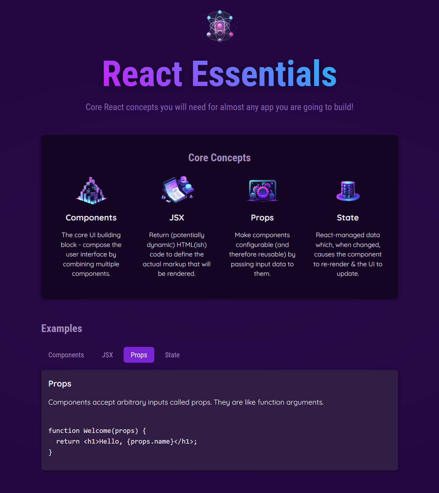

# Genesis
The code is based on React - The Complete Guide" course

[About course](https://www.udemy.com/course/react-the-complete-guide-incl-redux/?couponCode=KEEPLEARNING)

# Technologi used
- HTML
- JavaScript
- React

# Example

## Simple App presents basic mechanism in React

